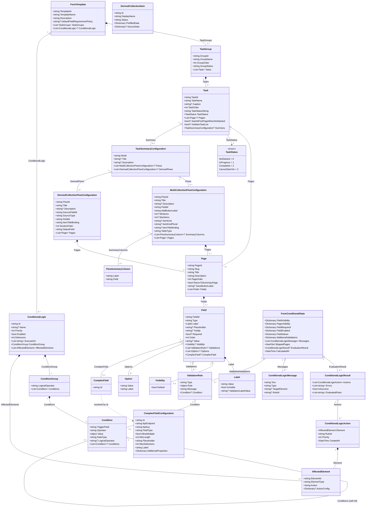
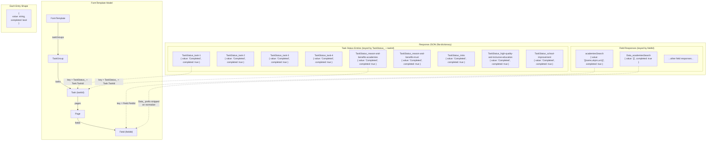
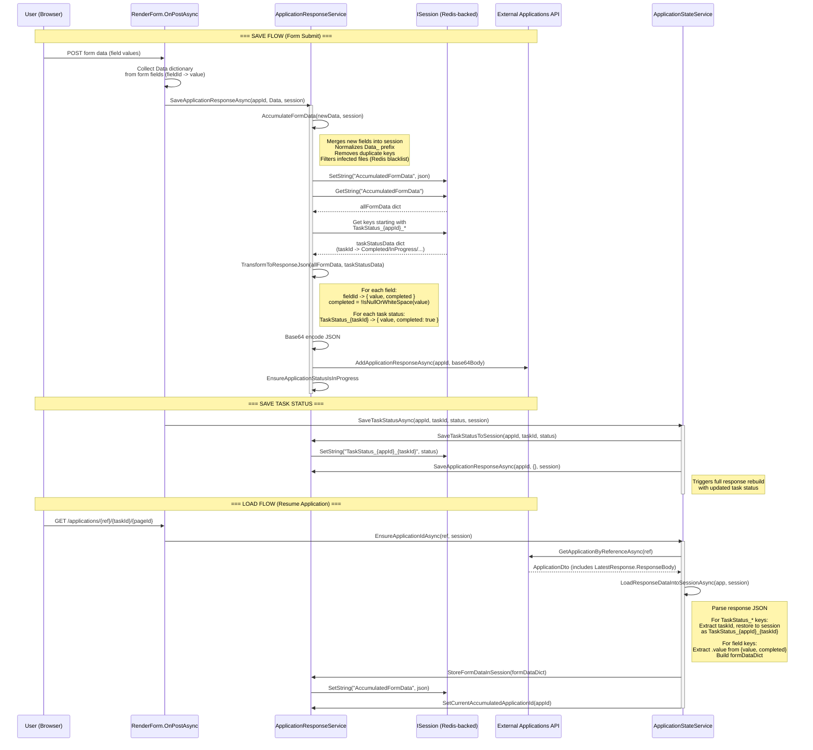

# Apply to transfer an academy – External Applications Web

This repository contains the Razor Pages frontend for submitting applications to transfer academies into another trust. It uses a Clean Architecture layout (Domain ➜ Application ➜ Infrastructure ➜ Web) and drives every screen from JSON form templates delivered by the External Applications API. Template-driven pages, conditional logic, file uploads, and contributor management are all orchestrated in the web layer while persistence and validation live in the API.

## Features
- 🧩 Template-driven form engine: tasks/pages/fields come from template schemas fetched via `ITemplatesClient` and parsed into domain models.
- 🔀 Dynamic logic: conditional visibility/requirements, collection flows, and derived collection flows handled server-side in `RenderForm`.
- 👥 Contributor management: invite/remove contributors before entering the form and keep application state in session + API.
- 🔐 Secure authentication: DfE Sign-in (OIDC) plus optional internal/test schemes; session-based token refresh and permissions caching.
- 🛡️ File uploads with AV protection: files posted to the API, scanned asynchronously, and cleaned/blacklisted when `ScanResultConsumer` receives an infected result.
- 📢 Notifications and events: publishes `TransferApplicationSubmittedEvent` to Azure Service Bus after successful submission; renders API-sourced notifications to users.
- 🚀 Production-ready concerns: redis + memory hybrid caching, gzip compression, Application Insights, GovUK Frontend rebrand, and MassTransit transport setup.
- 🛠️ Admin tools: role-restricted admin pages let you view the current template metadata, clear caches/sessions, and publish a new template version directly through the UI (with validation and cache invalidation).

## Architecture Overview 🧱
- **Web (Razor Pages)**: UI, request pipeline, auth, cookies, session, and form rendering (`Pages/FormEngine`, `Pages/Applications`, feedback, notifications).
- **Application**: Interfaces for form orchestration, state, validation, uploads, and event mapping.
- **Domain**: Template and form primitives (`FormTemplate`, `TaskGroup`, `Task`, `Page`, `Field`, `ConditionalLogic`, `EventMapping`).
- **Infrastructure**: Implementations that call the External Applications API (`IApplicationsClient`, `ITemplatesClient`, `INotificationsClient`), template stores/parsers, MassTransit consumers, redis-backed caching, and file upload handling.
- **Tests**: Unit tests for infrastructure/web and Cypress end-to-end specs.

## Domain Model Relationships (Template Models)

The template engine is built around a hierarchy of domain models in `DfE.ExternalApplications.Domain.Models`. The `FormTemplate` is the root, containing task groups, tasks, pages, and fields, with conditional logic attached at the template level.



## Application Response JSON Structure

When a user fills in a form, the engine saves responses as a flat JSON dictionary. Every entry has the shape `{ "value": "...", "completed": true|false }`. There are two categories of keys:

- **Field responses** keyed by `fieldId` (e.g. `"academiesSearch"`)
- **Task statuses** keyed by `"TaskStatus_{taskId}"` (e.g. `"TaskStatus_task-1"`)



## Response Save & Load Data Flow

The sequence below shows how `ApplicationResponseService` and `ApplicationStateService` collaborate to persist and restore application responses via session and the External Applications API.



## System Flow (happy path) 🔄
1. **Sign in** via DfE Sign-in (or test/internal auth in non-prod). Permissions are cached and refreshed via `TokenRefresh` settings.
2. **Dashboard** shows the user’s applications for the configured template; “Create” calls `CreateApplicationAsync`, stores IDs in session, and clears cached form data.
3. **Contributors** page lets the lead applicant manage collaborators before entering the form.
4. **Form engine** loads the current template (cached via `FormTemplateProvider` + `ApiTemplateStore`), restores response data from the API/session, and renders pages with conditional logic, collection flows, and complex fields (autocomplete, upload).
5. **File uploads** are sent to the API; scan results arrive on Azure Service Bus and `ScanResultConsumer` removes infected files, clears redis cache, and raises a user notification.
6. **Validation and navigation** are handled server-side; task completion is tracked per-task and persisted back through `IApplicationResponseService`.
7. **Submit** posts final responses to the API and publishes `TransferApplicationSubmittedEvent` to the Service Bus using the configured event mapping for the transfer template.

Example event publication in the form engine:

```3554:3592:src/DfE.ExternalApplications.Web/Pages/FormEngine/RenderForm.cshtml.cs
        /// Publishes the TransferApplicationSubmittedEvent to the service bus
        /// Uses the event data mapper to extract and transform form data according to the configured mapping
        private async Task PublishApplicationSubmittedEventAsync(ApplicationDto application)
        {
            var eventData = await _eventDataMapper.MapToEventAsync<TransferApplicationSubmittedEvent>(
                FormData,
                Template,
                "transfer-application-submitted-v1",
                application.ApplicationId,
                application.ApplicationReference);
            await publishEndpoint.PublishAsync(eventData, messageProperties, CancellationToken.None);
        }
```

## Key configuration ⚙️
All settings are standard ASP.NET Core configuration keys (appsettings or environment variables). Important ones:

| Key | Purpose | Dev value / notes |
| --- | --- | --- |
| `DfESignIn:Authority` / `ClientId` / `ClientSecret` / `RedirectUri` | OIDC login | Dev authority `https://test-oidc.signin.education.gov.uk`; set secrets locally. |
| `ExternalApplicationsApiClient:BaseUrl` | Backend API endpoint | `https://api.dev.apply-transfer-academy.service.gov.uk` (see `appsettings.Development.json`). |
| `ExternalApplicationsApiClient:ClientId` / `ClientSecret` / `Authority` / `Scope` | API auth (Azure AD) | ClientId preset; supply `ClientSecret` via user-secrets/env. |
| `Template:Id` | Template to render | Default transfer template `9A4E9C58-9135-468C-B154-7B966F7ACFB7`. |
| `FormEngine:ComplexFields` | External search endpoints | Dev APIs for trusts and establishments are prefilled in `appsettings.Development.json`. |
| `MassTransit:Transport` / `AzureServiceBus:ConnectionString` | Service Bus for events & AV scan results | Provide connection string to receive scan results and publish submissions. |
| `ConnectionStrings:Redis` | Redis for hybrid caching and sessions | Default `localhost:6379`. |
| `ApplicationInsights:ConnectionString` | Telemetry | Optional locally; required in cloud. |
| `TokenRefresh:*` | Session/token refresh windows | Defaults provided in `appsettings.json`. |
| `InternalServiceAuth:*` | Service-to-service auth | Used for internal APIs and virus-scan cleanup. |

## Running locally 🖥️
Prerequisites: .NET 8 SDK, Redis (local or container), Node/npm if running Cypress, and access to the dev External Applications API + Azure AD app registration.

1) Clone and restore  
```bash
dotnet restore DfE.ExternalApplications.Web.sln
```

2) Configure secrets (examples)  
```bash
# Auth & token refresh
dotnet user-secrets set "DfESignIn:ClientSecret" "<oidc-client-secret>" --project src/DfE.ExternalApplications.Web
dotnet user-secrets set "TokenRefresh:ClientSecret" "<oidc-client-secret>" --project src/DfE.ExternalApplications.Web

# External Applications API auth
dotnet user-secrets set "ExternalApplicationsApiClient:ClientSecret" "<api-client-secret>" --project src/DfE.ExternalApplications.Web

# Messaging / telemetry / cache
dotnet user-secrets set "MassTransit:AzureServiceBus:ConnectionString" "<sb-connection>" --project src/DfE.ExternalApplications.Web
dotnet user-secrets set "ApplicationInsights:ConnectionString" "<ai-connection>" --project src/DfE.ExternalApplications.Web
dotnet user-secrets set "ConnectionStrings:Redis" "localhost:6379" --project src/DfE.ExternalApplications.Web

# Internal service-to-service auth
dotnet user-secrets set "InternalServiceAuth:SecretKey" "<internal-signing-key>" --project src/DfE.ExternalApplications.Web
dotnet user-secrets set "InternalServiceAuth:Services:0:ApiKey" "<internal-api-key>" --project src/DfE.ExternalApplications.Web

# Optional: secured downstream APIs for complex fields (if required) 🔒
# Matching structure:
# {
#   "Id": "TrustComplexField",
#   "ApiEndpoint": "https://api.dev.academies.education.gov.uk/trusts?page=1&count=10&groupname={0}&ukprn={0}&companieshousenumber={0}&status=Open",
#   "ApiKey": "<trusts-api-key>"
# },
# {
#   "Id": "EstablishmentComplexField",
#   "ApiEndpoint": "https://api.dev.academies.education.gov.uk/v4/establishments?page=1&count=10&name={0}&urn={0}&ukprn={0}&matchAny=true&excludeClosed=true",
#   "ApiKey": "<establishments-api-key>"
# }
dotnet user-secrets set "FormEngine:ComplexFields:0:ApiKey" "<trusts-api-key>" --project src/DfE.ExternalApplications.Web
dotnet user-secrets set "FormEngine:ComplexFields:1:ApiKey" "<establishments-api-key>" --project src/DfE.ExternalApplications.Web
```

3) Use the dev API configuration  
`ASPNETCORE_ENVIRONMENT=Development` uses `appsettings.Development.json`, which already points to `https://api.dev.apply-transfer-academy.service.gov.uk` and the dev academies search endpoints.

4) Run the web app  
```bash
dotnet run --project src/DfE.ExternalApplications.Web/DfE.ExternalApplications.Web.csproj
```
Browse to `https://localhost:5001` (or the HTTPS port shown in the console) and sign in with a dev DfE Sign-in account.

5) Optional: receive virus-scan events  
Ensure the Service Bus connection string is set so `ScanResultConsumer` can process `ScanResultEvent` messages and clean infected uploads.

## Tests ✅
- Unit tests: `dotnet test DfE.ExternalApplications.Web.sln`
- Cypress (E2E): from `Tests/DfE.ExternalApplications.CypressTests`, install deps then run `npm test` or `npx cypress run`.

## Example workflow 📋
1. Create a new application from the dashboard (uses the configured template ID).
2. Add contributors and proceed to the form.
3. Complete tasks/pages; upload supporting documents (they will be virus-scanned).
4. Submit; the app persists responses to the External Applications API and publishes `TransferApplicationSubmittedEvent` to Service Bus for downstream processing.

## Admin pages (template management) 🛠️
- Access: available to users in role `Admin`; entry point at `/Admin/Admin` with a link to `/Admin/TemplateManager`.
- Admin dashboard: shows the current template ID/name/description/version, task group count, cache key status, and tokens; provides a “clear all” to wipe session and template cache.
- Template Manager:
  - Displays the current template JSON and latest version (fetched from the API; cache is cleared before loading).
  - “Add template version” flow validates the provided JSON against the form template schema, base64-encodes it, and calls `CreateTemplateVersionAsync`.
  - Auto-suggests the next patch version, and after creating a version, clears and verifies cache so the new schema is served immediately.
  - Includes “clear all” to drop session and cache and return to dashboard if the template ID is lost.

## Notes 🧠
- Clean Architecture boundaries are enforced: web depends on application interfaces, implementations live in Infrastructure, and templates are domain-driven JSON schemas.
- If you change template IDs or event mappings, update `Template:Id` and the mapping under `EventMappings/<template>/`.

